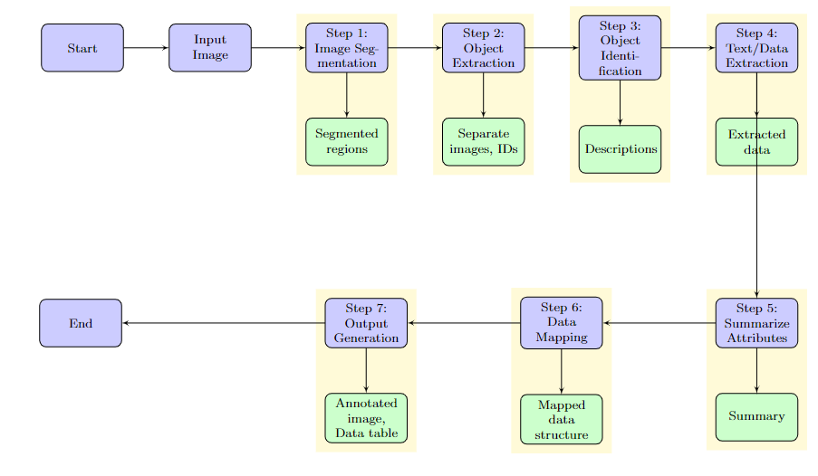

# AI Image Segmentation and Analysis Pipeline

This project implements an AI pipeline for image segmentation and object analysis using deep learning models. It processes input images to segment, identify, and analyze objects within the image, outputting a summary table with mapped data for each object.

<!-- adding an image of flowdiagram -->


## Features

- Image segmentation using pre-trained models
- Object extraction and storage
- Object identification
- Text/data extraction from objects
- Summarization of object attributes
- Data mapping of extracted information
- Output generation with annotated images and summary tables
- Streamlit-based user interface for easy interaction

## Installation

1. Clone this repository:
   ```
   git clone https://github.com/yourusername/ai-image-segmentation.git
   cd ai-image-segmentation
   ```

2. Create a virtual environment (optional but recommended):
   ```
   python -m venv venv
   source venv/bin/activate  # On Windows, use `venv\Scripts\activate`
   ```

3. Install the required packages:
   ```
   pip install -r requirements.txt
   ```

## Project Structure

```
ai_pipeline/
├── main.py
├── app.py
├── requirements.txt
├── README.md
├── segment.py
├── extract.py
├──  identify.py
├──  extract_text.py
├── summarize.py
├──  map_data.py
└── generate_output.py
```

## Usage

### Command Line Interface

To process a single image using the command line:

```
python main.py
```

Make sure to set the `image_path` variable in `main.py` to the path of your input image.

### Streamlit User Interface

To launch the Streamlit web application:

```
streamlit run app.py
```

This will start a local server and open the application in your default web browser. You can then upload an image and process it through the pipeline using the web interface.

## Pipeline Steps

1. **Image Segmentation**: Segments all objects within the input image.
2. **Object Extraction**: Extracts each segmented object and stores it separately.
3. **Object Identification**: Identifies and describes each extracted object.
4. **Text/Data Extraction**: Extracts any text or data from each object image.
5. **Attribute Summarization**: Summarizes the nature and attributes of each object.
6. **Data Mapping**: Maps all extracted data and attributes to each object.
7. **Output Generation**: Generates a final output with annotated image and data table.

## Dependencies

- PyTorch
- TensorFlow
- OpenCV
- Pillow
- NumPy
- Matplotlib
- Pandas
- Pytesseract
- Transformers
- Streamlit

For a complete list of dependencies, see `requirements.txt`.

## Contributing

Contributions to this project are welcome. Please feel free to submit a Pull Request.

## License

This project is licensed under the MIT License - see the LICENSE file for details.
```

This README provides an overview of your project, including its features, installation instructions, project structure, usage guidelines, and a brief description of each step in the pipeline. It also mentions the main dependencies and provides information about contributing and licensing.

You may want to customize this README further based on specific details of your project, such as:

1. Adding more detailed usage examples
2. Providing information about the specific models used (e.g., which pre-trained models for segmentation, identification, etc.)
3. Including troubleshooting tips or FAQs
4. Adding badges (e.g., build status, code coverage, version)
5. Providing contact information or links to further documentation

Remember to create a `LICENSE` file if you mention it in the README. The MIT License is a good choice for open-source projects, but make sure it aligns with your intentions for the project.